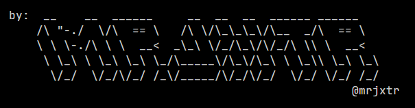

# 🎰 Python Slot Machine 🎰

Welcome to the most exciting command-line casino this side of Las Vegas! 🌟

## 🎲 What's This All About?

Ever wanted to experience the thrill of a slot machine without risking your life savings? Look no further! This Python-powered slot machine brings all the excitement of the casino floor right to your terminal. It's perfect for:

- 🎓 Learning Python in a fun way
- 🕹️ Killing time during compile breaks
- 🧪 Testing your luck (without the financial ruin)

## 🚀 Features

- 💰 Deposit virtual money (no real cash required!)
- 🎛️ Choose your bet amount and number of lines
- 🌈 ASCII art display
- 🎭 Realistic(ish) slot machine mechanics
- 🏆 Win big... or lose it all (but not really)

## 🤔 Why This Project?

Because coding should be fun, and what's more fun than a slot machine that can't empty your wallet? It's a great way to practice Python, learn about game logic, and pretend you're a high roller – all from the comfort of your own command line.

## 🛠️ How to Use

1. Clone this repo faster than a card shark shuffles a deck
2. Run `python src/main.py` and watch the magic happen
3. Follow the on-screen prompts to play
4. Try not to get addicted (seriously, it's just a game)

## 🧑‍💻 Code Structure

- `src/main.py`: Where the magic begins
- `src/utility/slot_machine.py`: The brains of our operation
- `src/utility/config.py`: Tweak the odds (but don't tell anyone)
- `src/utility/ascii_art.py`: Because who doesn't love ASCII art?

## 🎨 ASCII Art Preview

## 🙏 Acknowledgments

- Inspired by real slot machines (but much less expensive)
- Built with love, Python, and probably too much caffeine

## 📜 License

MIT License (aka the "Have Fun But Don't Blame Us" license)

---

Remember, the house always wins... except when it's all virtual and you're just here to have fun! Happy spinning! 🎉
